<div align="center">

# Clarion

### A voice co-pilot that lets blind and low-vision people finish private, high-stakes web tasks *themselves*.

**It finds the thing, reads back exactly what's on the page — and says when it _can't_ find something instead of guessing — and keeps the human in command at every consequential step.**

_Clarion — you're in command._

`Chrome MV3` · `LiveKit` · `MiniMax` · `Moss` · `Deepgram` · `LangGraph` · `Playwright/CDP`
Built for the **YC Conversational AI Hackathon** (June 6–7 2026) · Track: **Support**

</div>

---

## The one idea

Voice models are now cheap and fast. **Retrieval is the bottleneck — and trust is the product.** For a sighted user, a wrong word on screen is a shrug. For a blind user who can't cross-check the page, a confident hallucination during a bill payment is a disaster. So Clarion is built on one non-negotiable contract:

> ## No fact without a source. No action without a yes.

- **Epistemic (grounding):** Clarion never *speaks* a fact it didn't just retrieve — including negatives ("there is **no** late fee on this page"). If it can't ground a claim, it says so. It never guesses.
- **Agentic (consent):** Clarion never *commits an irreversible action* (pay, submit, enroll) without an explicit, per-step "yes."
- **Memory (privacy, opt-in `CLARION_MEMORY=1`):** a third clause at the implementation level — **no memory without a yes.** Clarion never persists a user fact, preference, or workflow without an explicit "remember this," and a recalled value re-enters only as a *hint to re-ground live* — it is structurally unspeakable, never spoken from memory.

Everything below — the architecture, the memory layer, the demo, the reason this wins — is downstream of that one invariant.

---

## 1. System architecture

Two planes and an actuator, wired by **events, not nested loops**. The kernel imports **zero provider SDKs** — every vendor lives behind a port, so the whole stack is swappable.

```mermaid
flowchart TB
    human(["🗣️  Human — speaks / hears"])

    subgraph VOICE["🎙️ Voice Plane · LiveKit — owns the &lt;800ms turn budget"]
        direction LR
        STT["Deepgram<br/>STT (EN)"] --> TURN["turn-detect<br/>· barge-in"] --> TTS["LiveKit Inference TTS<br/>Cartesia Sonic-2<br/>· Aura-2 failover"]
    end

    subgraph TASK["🧠 Task Plane · LangGraph kernel — LLM decides, kernel enforces"]
        direction LR
        G["GROUND"] --> V["VERIFY<br/>membership +<br/>pairing fence"] --> P["PROPOSE<br/>← LLM Reasoner"] --> IG{{"IRREVERSIBILITY GATE<br/>reversible · irreversible · UNKNOWN"}} --> C{{"CONSENT<br/>interrupt() = 'yes?'"}} --> A["ACT"] --> CF["CONFIRM<br/>code done-check"]
        CF -.->|"next sub-goal"| G
    end

    subgraph ACTU["🖱️ Actuator · extension chrome.debugger (product) / Playwright CDP (proof)"]
        direction LR
        AX["numbered<br/>Accessibility Tree"] --> SM["selector_map"] --> AC["act"] --> RP["re-perceive<br/>· diff"]
        RP -.->|"loop"| AX
    end

    subgraph KNOW["📚 Knowledge layer · Moss — local-first ~3ms · ONE index per CATEGORY + metadata filter"]
        direction LR
        KB[("clarion-kb<br/>policy KB")]
        SITE[("clarion-site-structure<br/>page affordances · {site}")]
        PROF[("clarion-profile<br/>facts + prefs · {user}")]
        PATHS[("clarion-task-paths<br/>workflow episodes · {user}")]
    end

    REASONER[["🤖 Reasoner · MiniMax-M3<br/>(M2.7 failover) · plans goal +<br/>decides next step · frozen port"]]

    human ==>|"speech"| STT
    TTS ==>|"audio"| human
    TURN -->|"advance_task() · non-blocking"| G
    IG ==>|"irreversible / UNKNOWN<br/>surfaces 'yes?'"| TTS
    KB -->|"grounded facts + source_node_id"| G
    REASONER -->|"plan + next grounded step"| P
    P -->|"selector_map → act"| SM
    RP -->|"observation"| V

    SITE -.->|"SITE MAP · affordances, never values"| REASONER
    PROF -.->|"recall prefs → re-ground live"| REASONER
    PATHS -.->|"recall prior plan (hint only)"| REASONER
    CF -.->|"write-back: facts · episodes<br/>(prefs consent-gated)"| PROF
    CF -.-> PATHS

    classDef gate fill:#fde68a,stroke:#d97706,stroke-width:2px,color:#1c1917;
    classDef store fill:#e0f2fe,stroke:#0284c7,color:#0c4a6e;
    classDef mem fill:#dcfce7,stroke:#16a34a,color:#14532d;
    class C gate
    class KB store
    class SITE,PROF,PATHS mem
```



<details>
<summary><i>Plain-text fallback (if your viewer doesn't render Mermaid)</i></summary>

```
HUMAN ⇄ Voice Plane [LiveKit: Deepgram STT · turn-detect · barge-in · LiveKit Inference TTS]   (<800ms turn budget)
                │ advance_task()                        ▲ CONSENT surfaces "yes?" via TTS
                ▼  (non-blocking)                       │
Task Plane [LangGraph]:  GROUND → VERIFY → PROPOSE → ⟨GATE⟩ → ⟨CONSENT⟩ → ACT → CONFIRM ──┐ next sub-goal
   (MiniMax-M3 Reasoner plans the goal + decides each grounded step; the kernel enforces the invariants)
   ▲ grounded facts          ▲ observation                  │ selector_map → act           │
   Moss (~3ms) ──────────────┘                              ▼                              │
   Knowledge layer [Moss, one index/category]:              Actuator [ext chrome.debugger / Playwright CDP]:
     clarion-kb (policy) · clarion-site-structure (page         AXTree → selector_map → act → re-perceive ⟲
     affordances) · clarion-profile (facts+prefs) ·
     clarion-task-paths (episodes) → recall warm-starts the plan (hint only, re-grounded live);
     write-back is consent-gated (no memory without a yes)
```
</details>

**The loop** (`kernel/graph.py`) is the heart, and it is **de-hardcoded — the LLM decides, the kernel enforces.** `GROUND` retrieves; `VERIFY` asserts only grounded facts (and confirmed absences) and adds the **membership + pairing fences** (a value is speakable only if it is byte-identical to a live grounded `Fact`, and an "X is Y" claim needs a single geometric `PairedFact` backing both halves); `PROPOSE` is the LLM **`Reasoner`** choosing the next grounded action — given the **full situational context** (a `DecideContext`: the user's *verbatim* intent, the current plan phase + its done-check, the live page, the step history, and what just happened) so the decider is the best-informed agent in the loop — over a ranked slice; a pure post-decode guard rejects any off-page index or invented value; the **`IRREVERSIBILITY GATE`** is dual-signal (`reversible | irreversible | UNKNOWN`) — the model's judgment AND a code structural pre-screen, where **either can escalate and the model can never downgrade**, and `UNKNOWN` routes through `CONSENT` even in Fast mode; the **`CONSENT` gate** (LangGraph `interrupt()`) blocks until the human says yes; `ACT` is idempotent (checks the consent-log once-flag before side-effecting); `CONFIRM` advances only on a **code-selected, page-verified done-check** (the model never grades its own success).

### 1.1 The de-hardcoded design (Clarion-PE/G) — SHIPPED

The task plane carries **no per-site, per-goal logic.** One generic LLM plans the goal into sub-goals and decides each next grounded action **behind a frozen `Reasoner` port**; regex/parsing/selectors survive only as a *parallel hint layer the model can override*, never as the decider. The kernel keeps only the two invariants + consent. Four code-enforced closers make it safe for someone who can't see the page:

- **`PairedFact`** — label↔value paired *geometrically* at extract time (`aria-labelledby` / `for` / shared-row bbox / DOM ancestry, never reading-order), so a clean citation can never land on the wrong number.
- **Dual-signal irreversibility gate** — the closed `pay/submit/confirm/send` keyword list is **deleted**; structure + model judgment gate any consequential control on any site, fail-closed to `UNKNOWN`.
- **Generic done-check** — the Reasoner *selects* a registered check (`field_nonempty` / `node_added` / `error_absent` / `navigated` / `confirmation_fact`); code evaluates it against the re-perceived tree + a semantic (URL) anchor.
- **NegativeVerifier** — a spoken negative ("no late fee") comes only from a closed-world search with coverage evidence, else it **downgrades to an honest hedge.**

**Proven end-to-end on two real government sites with zero site-specific code:** a usa.gov read-only lookup (grounded values + real citations, anchor-certified) and a real form (filled, then the submit classified `UNKNOWN` → consent **hard-stop** → declined, never submitted). The generality montage isn't a promise — it's the architecture.

**Ports (the swap seams) — `contracts/ports.py`, FROZEN:**

| Port | Live adapter (event-day) | Responsibility |
|---|---|---|
| `VoiceTransport` | **LiveKit** (+ Deepgram STT `nova-3`, EN-only) · TTS = **LiveKit Inference** (Cartesia Sonic-2 + Deepgram Aura-2 failover, native — no per-provider key) | audio in/out, turn detection, barge-in |
| `Retriever` | **Moss**, local-first (built-in `moss-minilm` embeds in-process; Gemini `gemini-embedding-001` custom-vector fallback) | `query → grounded facts[] + source_node_id`, sub-10ms in-memory |
| `Reasoner` | **MiniMax-M3** (OpenAI-compatible) · **MiniMax-M2.7** failover (`FallbackAdapter`) | `plan_goal → specific sub-goals` (named to the real goal + live controls, zero site code) · `decide_step(…, context) → next grounded action`, fed a rich `DecideContext` (verbatim intent · plan phase · live page · history); the de-hardcoding boundary, the **only** LLM home (`gemini_reasoner`/`openai_reasoner` kept as alternate backends) |
| `Synthesizer` | **MiniMax Speech** (`/v1/t2a_v2`) — the *kernel-facing* contract object (the audio you **hear** is the LiveKit Inference TTS above) | `text → audio` |
| `Actuator` | **extension `chrome.debugger`** relay (product path, the user's real tab) · **Playwright/CDP** (autonomous proof) | merged numbered AXTree → act → re-perceive |
| `Ingest` | site / doc → KB (`site_indexer` read-only crawl → `clarion-site-structure`) | parse + index pages and policy docs |
| `Memory` | checkpointer + **Moss category indexes** (`clarion-profile` facts+prefs · `clarion-task-paths` episodes, `{user_id}`-filtered; `CLARION_MEMORY=1`) | durable goal-state; recall warm-starts the plan (hint only); write-back is consent-gated |

**Why the accessibility tree, not screenshots:** the AXTree is the same structured surface a screen reader consumes — robust on messy real sites (Shadow DOM, unlabeled fields, mid-flow layout shifts) where vision-based agents break. It's also how Clarion *grounds* its readback: every spoken fact carries a `source_node_id`. A `Fact` with `source_node_id = None` is ungrounded and is **never spoken** — the invariant, enforced in code.

**Two modes** (`kernel/policy.py`, a 2-clause policy):
- **Normal (default):** human-in-the-loop, per-step confirmation. The validated design.
- **Fast (opt-in):** runs ahead through reversible steps (navigate, read, fill) but **hard-stops at any step the dual-signal gate marks `irreversible` _or_ `UNKNOWN`.** No keyword list — structure + model judgment, fail-closed. "Earns autonomy on the boring steps, never on the irreversible one."

### 1.2 The knowledge layer — indexed pages + opt-in user memory (`CLARION_MEMORY=1`)

Clarion learns across runs without ever eroding the invariant. Everything lives in **Moss, one index per data _category_** with a metadata `filter` (`{site}` / `{user_id}`), never one index per site or tenant — local-first, sub-10ms, embedded in-process:

- **Indexed webpages — `clarion-site-structure`** (`app/site_indexer.py`, gated `CLARION_SITE_KNOWLEDGE=1`, fail-open). A read-only same-origin crawl records each page's **affordances — headings + controls, _never live values_** — partitioned by `{site}`. At PLAN, `SiteKnowledge` folds a **SITE MAP** into the Reasoner's orient so it can pick which page to navigate to. Structure, not data: it can never become a spoken fact.
- **User memory — `clarion-profile` (facts + prefs) + `clarion-task-paths` (episodes)** (`retrieval/memory_moss.py`, `{user_id}`-filtered). A finished run writes a `WorkflowEpisode` (goal + plan, **never grounded values**); `Memory.recall` warm-starts the **next** plan with a `prior_plan_hint` and reminds the user what they consented to last time.

**The firewall (load-bearing, structural).** Recall is a non-`Fact` `Recall` type with **no `source_node_id` field**, and lives on the `Memory` port — never the `Retriever` (which would stamp a live source onto a remembered value). So a recalled value is **structurally unspeakable**: it re-enters only as planner advice / a fill candidate and is **re-grounded live** before anything is spoken or any irreversible step runs. A remembered "approve" never auto-approves — every irreversible step still hits a fresh `interrupt()`. Preference capture is a consent-gated, end-of-flow **"remember?"** offer with secret-suppression (passwords, OTP, CVV, SSN are never offered) — _no memory without a yes_. Spec: `docs/clarion-memory-design.md`.

**Stack (locked):** Python 3.12+, `langgraph 1.x` (`interrupt`/`Command`, `InMemorySaver`), `pydantic 2.x`, `playwright`, `livekit-agents>=1.5.15` · **Chrome MV3 extension** (vanilla JS — the product UI); `web/demo-site` + `web/panel` are Next.js 16 / React 19 auxiliaries, not the deliverable. Providers split by extra: `.[test]` (no network), `.[spike]` (LiveKit + MiniMax + Deepgram + anthropic-plugin + Playwright), `.[retrieval]` (Moss + genai embed-fallback).

**Repo layout** (directory ownership = collision-free):
```
agent/clarion/contracts/   ports (incl. Reasoner · Memory) · state (Fact.id · PairedFact · Recall) · events  ← FROZEN
            /kernel/        graph (loop + gate) · policy (fences) · reasoner_guard · irreversibility · negative_verifier
            /actuator/      merged-AXTree perception (lazy-stamp) + act + diff + geometric PairedFacts
            /stages/        generic executor + checks (code done-check) + RESCUE cross-cut
            /adapters/      voice_livekit · minimax_reasoner (default) · minimax_synthesizer · gemini/openai_reasoner (alternates)
            /retrieval/     moss_client · retriever_moss · memory_moss (user memory) · ingest_gemini (embed-vector fallback)
            /instrument/    latency meter · cold-RAG baseline · to_panel_state
            /app/           runtime · gov_proof (autonomous TAS driver) · voice_entry · extension_runtime · site_indexer · remember
web/extension/  THE PRODUCT — Chrome MV3   ·   web/demo-site/  ·  web/panel/  ·  web/spike-target/  (Next.js aux, NOT test targets)
docs/foundation.md (why) · docs/execution.md (build) · docs/clarion-memory-design.md (memory) · docs/clarion-status.md (live status)
```

---

## 2. Why this wins

### Why there's a real gap

We checked the field, hard. The market splits into two halves and **nobody owns the middle**:

- **Describers** (Be My AI, Seeing AI, Aira) are loved but **stateless and not goal-oriented** — the literature's exact complaint: *"Be My AI loves general descriptions, it doesn't know what to focus on."* It tells you about the screen; it doesn't drive the task.
- **General web agents** (Operator, ChatGPT Atlas, Gemini Auto Browse) are goal-oriented but **inaccessible by default** (Atlas scored **1/10** for screen-reader access), **break on messy real sites**, and **strip agency** — they auto-pick options and leave the user unsure anything happened.

Clarion is the unserved intersection: **task-aware + voice-first + blind-specific + per-step verified.** No shipping product sits there.

### Why the demand is real (and where we were honest with ourselves)

The validated, *paid* demand is for exactly Clarion's core — digital-task **rescue**, not autonomous delegation:

- **Aira 2024 Explorer Survey:** 66% use it for inaccessible elements/CAPTCHA · **65% for inaccessible online forms** · **62% to troubleshoot when their screen reader fails.** People pay humans for this today.
- **WebAIM Screen Reader Survey #10** (n=1,539): CAPTCHA is the #1 wall; 58% route to a mobile app to escape broken web.
- **Banking** (First Monday, n=162): 80%+ bank weekly; **54.3% are blocked from bill pay; 76.5% had to ask another person for help.**
- **The framing insight:** every failed self-service flow **forces a support escalation** (phone agent, branch, sighted helper) — ~2/3 of e-commerce gets abandoned (McKinsey). Clarion is **escalation deflection for the disabled-customer segment**, a real customer-service KPI. That's the Support track, cleanly.

### Why the design is right (it's peer-reviewed)

This isn't a hunch. **Morae** (UIST '25) ran the study: proactively pausing a UI agent for blind users — Clarion's exact design — beat OpenAI Operator on **Awareness-of-Actions (6.2 vs 4.9)** and **Results (6.4 vs 4.6).** A 2026 CHI Wizard-of-Oz study found a human-in-the-loop double-check before payment is *required, not optional*. ASSETS '24 showed blind users over-trust confident AI and verify more for money — which is **why** grounding + consent is the whole product, not a feature.

### Why it's a good demo

The hackathon thesis is "retrieval is the bottleneck." Clarion's invariant puts retrieval **on the critical path of every utterance** — the agent literally cannot speak without grounding first — so the thesis isn't a slide, it's the load-bearing wall. The demo makes that **visible**:

1. **Speculative retrieval** — queries fire *while the user is still talking* (on partial STT). The thesis, on screen.
2. **Live latency meter** — `Moss: ~3ms` next to a greyed `cold RAG: ~340ms`. Retrieval disappears from the budget.
3. **Sources + negative-verification panel** — every spoken fact cited; *"no late fee — verified: not present."*
4. **Barge-in** — interrupt mid-sentence, instant stop.
5. **The consent gate as a visible state** — `AWAITING YOUR YES` at the autopay upsell and at submit.
6. **Glass-box trace** — every step and the "why" behind it.

**Demo set:** one primary live run — utility **bill-pay** on a self-hosted clone with authentic accessibility flaws (stuck-rescue → verified readback → consented payment behind the hard-stop) — plus a **generality montage** of the same agent on the worst real tasks: government/benefits portals (68 min per barrier), travel booking (91–94% barriers), shopping checkout (86%). It never looks hardcoded. The human close: *"I did it myself."*

---

## 3. Readiness, the hard questions, and our task focus

### How we're ready

- **Deterministic regression gate:** `212 passed, 10 deselected`, fully offline (`.[test]` pulls no network) — including a goal-agnostic invariant spec whose guards are proven **red-before-green by mutation** (disable the structural net / the post-decode guard / the grounding check → the matching invariant test goes red), plus a no-network `FakeMemory` round-trip that asserts recall never carries a `source_node_id`.
- **Providers live (event-day):** LiveKit · Deepgram STT (`nova-3`, EN-only) · **MiniMax-M3 brain** (M2.7 failover) · **LiveKit Inference TTS** (Cartesia Sonic-2 + Deepgram Aura-2 failover) · **Moss retrieval live**, `clarion-kb` + `clarion-site-structure` built and persistent; the user-memory indexes (`clarion-profile` / `clarion-task-paths`) ship behind `CLARION_MEMORY=1`.
- **Judge-proof offline path:** `CLARION_DEMO_MODE=1` replays the hero run with no network, so a venue Wi-Fi failure can't kill the demo. Reliability is an engineering choice, not luck.
- **Latency engineered, not hoped:** Moss is pre-warmed and the embed fires on partial-STT so the on-stage retrieval number is the in-memory **~3ms**, inside LiveKit's **<800ms** turn budget.

```bash
# deterministic gate (no network)
cd agent && pip install -e ".[test]" && python -m pytest clarion          # 212 passed, 10 deselected

# the de-hardcoded proof, fully live on REAL gov sites (Playwright + MiniMax-M3 Reasoner)
cd agent && pip install -e ".[spike]" && pip install -e ".[retrieval]"
.venv/bin/playwright install chromium
.venv/bin/python -m clarion.app.gov_proof          # generic TAS driver: usa.gov + a real form, zero site-specific code

# live-voice product path — the Chrome MV3 extension on a real tab
scripts/clarion-up.sh        # logsink + broker + worker + opens Chrome for Testing (durable profile)
scripts/clarion-status.sh    # ports + procs + tail of every log (run this first to see state)
scripts/clarion-down.sh      # stop everything
```

### The hard questions (and our answers)

We pressure-tested Clarion in an adversarial founder review. The answers are in the design, not in spin.

- **"Isn't this just an accessibility overlay like accessiBe?"** — No, it's the structural opposite. Overlays are *vendor-installed, business-side,* and *override the user's screen reader without consent* (which is why the community got a $1M FTC fine levied and 800+ experts to sign against them). Clarion is **user-owned, opt-in, per-step consent, never installed on the business's site, never overrides the AT.**
- **"Why would a blind power user trust your AI over their own NVDA skills?"** — We don't replace the screen reader. We rescue the moment it *fails* — the exact thing 62% already pay Aira for. Augment, never seize.
- **"How can a blind user verify the agent didn't misread the amount?"** — Read from the accessibility tree (not a screenshot), cite the `source_node_id`, negative-verify, cross-check the amount against the known balance, then per-step consent + a hard-stop on anything irreversible. Honest limit: this *reduces*, it doesn't *eliminate* — non-visual verification of a visual medium is a forever-hard problem, which is exactly why the consent gate exists.
- **"What about payments and liability?"** — Payment is a *consented* beat behind the Normal-mode hard-stop. Clarion does not autonomously move money. The demo runs on a sandboxed clone — no real credentials, no real funds.
- **"Won't Apple/Google absorb this?"** — Real risk, and we say so. Our edge is blind-specific UX + verification discipline + cross-site reach. For the hackathon it's a demo that works today; the company moat is an honest open question (see `docs/foundation.md §9c`).
- **"Is the AI actually central?"** — Yes: goal-state planning, page perception, grounded verification, and turn-taking are all model-driven. Strip the model and there's no product.

### How we define ourselves: **task focus**

The word that separates Clarion from everything else is **task-aware** — it tracks **goal-state**. A describer narrates a screen; Clarion holds the goal ("pay my electric bill"), ignores page noise, reads only the goal-relevant fields *in order*, tracks progress, knows what *done* looks like, detects a silently-failed step, and verifies the facts that matter (amount, payee, due date) instead of describing everything. The validated workflows we focus on, in priority order:

1. **Complete an inaccessible form / checkout** (Aira 65%; bill-pay 54% blocked)
2. **"Rescue me, I'm stuck"** when the screen reader chokes on a widget (Aira 62% — our strongest trigger)
3. **Login / identity verification** (the first wall; documented account-lockout failures)
4. **CAPTCHA** — the #1 wall, which we *assist/hand-off,* never pretend to auto-solve

We are deliberately **not** an autonomous-payment agent, not a CAPTCHA-defeater, and not a business-side compliance band-aid. Saying no to those is what keeps the trust.

---

## What's honestly unsolved

Judges respect candor more than a clean story, so: non-visual verification is reduce-not-eliminate; current models miss too often for *autonomous* irreversible actions (hence the hard-stop); CAPTCHA stays a wall; demand for *delegation* (vs. assisted self-action) is unproven; and at company scale, distribution against the platforms is an open question. Clarion is scoped precisely around what the evidence supports — and explicit about the rest.

---

## Docs & evidence

- **`docs/foundation.md`** — the full why: reasoning trail, evidence with citations (and corrections), two modes, worries, scope.
- **`docs/execution.md`** — the build spec.
- **`docs/clarion-architecture.md`** — the de-hardcoded design (Clarion-PE/G).
- **`docs/clarion-memory-design.md`** — the knowledge layer: indexed pages + opt-in user memory and the "no memory without a yes" firewall.
- **`docs/clarion-status.md`** — LIVE status: what's real vs hardcoded, what's left.
- **`docs/persona.md`** — Maya, and the "competent, not helpless" voice rules.
- **`research/`** — the hackathon thesis + winner patterns, and the execution-architecture brief.

> **Invariant, one more time, because it's the whole thing:** _No fact without a source. No action without a yes._
